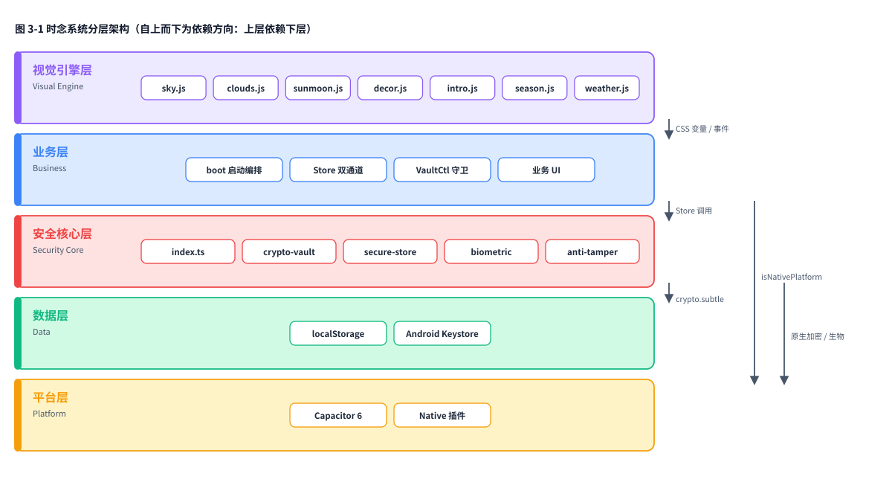
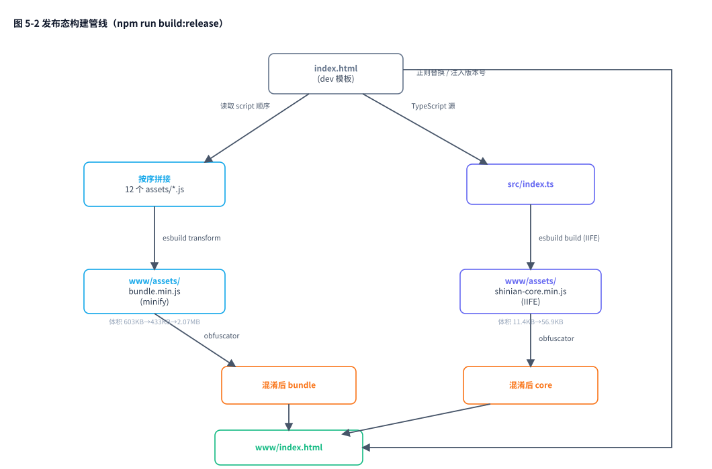
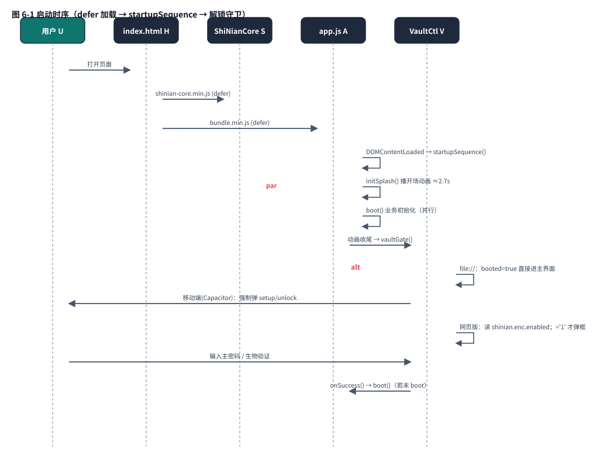
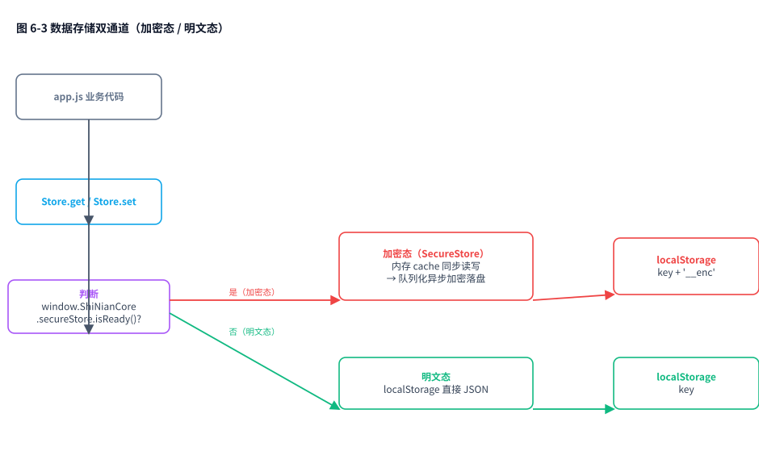
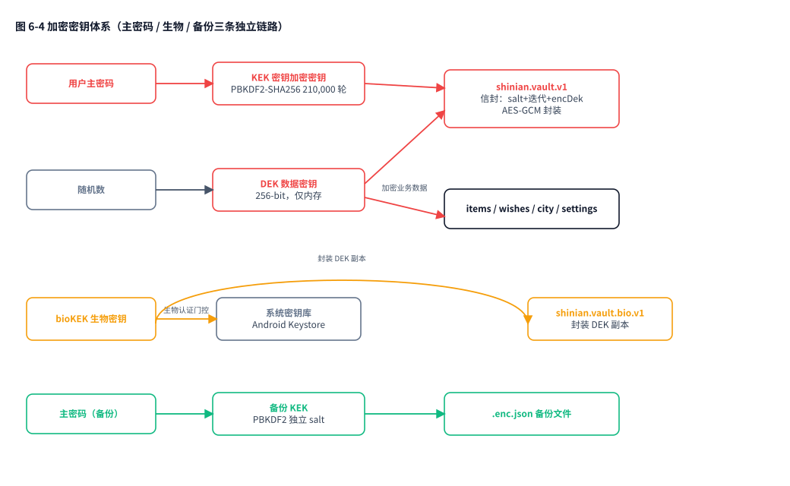

# 时念 ShiNian · 架构文档

> **文档性质**：架构现状快照（Architecture Snapshot），对齐代码版本 **v1.1.3**
> **快照基准**：`package.json` version = `1.1.3` · 文档初稿 HEAD = `7b67024` · 生成日期 2026-10-08
> **最近同步**：2026-10-09 同步 **P1（B3 RASP 运行时接通 `2242f5d`）→ P2（收敛 index.ts 双导出 `53ecfe2`）→ P3（混淆产物校验接入 CI `ac6848b`）** 状态——见第 0 / 7.1 / 7.4 / 10.1 / 10.4 / 11 章
> **读者指引**：决策者读第 0、1、2、10 章；开发 / AI 协作方读第 3–9、11 章与附录
> **许可**：本文属 `docs/` 目录，采用 [CC BY-NC-SA 4.0](./LICENSE-DOCS)（禁止商用、需署名、相同方式共享）

---

## 0. 结论先行

| # | 结论 | 严重程度 |
|---|---|---|
| 1 | 项目已形成稳定的「**零构建 dev 态 + esbuild 发布态**」双形态混合架构，这是它最核心的架构特征，也是全部设计约束的源头 | 基线 |
| 2 | 安全架构（加密保险库 / 生物锁 / 应用锁 / 反篡改 / 混淆）**代码质量扎实**，双层密钥与 21 万轮 PBKDF2 均达 OWASP 量级 | 基线 |
| 3 | 反篡改模块（B3）RASP 六类检测已在 **P1 接通运行时调用**（此前"装了没开"，只在单测跑过）；默认仅告警不阻断 | ✅ 已修复 |
| 4 | `src/index.ts` 原先存在**两套并存的导出路径**（手工聚合对象 + `export * as ns`），已在 **P2 收敛为直接引用完整命名空间**，消除漏函数隐患 | ✅ 已修复（P2） |
| 5 | `typecheck` 质量门**只覆盖 `src/` 的 6 个 TS 文件**，`assets/` 下约 5 000 行 vanilla 主力代码不在门内 | **P2**（10.3，仍未修） |
| 6 | 三个校验脚本（`_verify_obf.js` / `chaincheck.js` / `bundlecheck.js`）游离在仓库根目录，未接入 `npm test`；其中 **`_verify_obf.js` 已在 P3 接入 CI**，`chaincheck.js` / `bundlecheck.js` 仍游离 | 部分修复（P3） |
| 7 | `android/` 与 `www/` 均不入库，**APK 无法在本地复现**，完全依赖 GitHub Actions | 已知取舍 |

一句话：**架构骨架是对的，安全层的"接线"有几处没接牢**。第 10 章给出逐项清单。

---

## 1. 产品定位与三条硬约束

时念是一款**单机、本地优先**的时间工具：天空随真实时刻 / 季节 / 天气流动，时钟、倒数日、许愿、提醒以玻璃卡片浮于其上。

架构上的一切"奇怪选择"都能追溯到三条硬约束：

| 约束 | 内容 | 它对架构的连带影响 |
|---|---|---|
| **C1 · 零构建双击可用** | 仓库根 `index.html` 双击（`file://`）必须全功能可开 | 源码必须是**经典脚本 + 全局符号**，不能用 ES Module（`file://` 下 CORS 会拒绝 `import`）；不能引入需编译的语法 |
| **C2 · 运行时零框架依赖** | 不引入任何前端框架、动画库、加密库 | 云引擎 / 装饰层 / 加密层全部自研或 vendored；加密只用浏览器原生 Web Crypto |
| **C3 · 零后端、零采集** | 无服务器、无账号、不上传任何个人信息 | "服务器端安全"整类威胁天然不成立；唯一出站请求是 Open-Meteo 天气 API |

> C1 与 C2 直接解释了为什么项目**不用 Vite / 不用打包器做 dev**：Vite 是 dev-server 型工具链，其最大卖点 HMR 对"AI 全程写码"的场景收益近乎为零，却会破坏"双击即开"。

---

## 2. 三种运行形态（理解本项目的钥匙）

同一套源码，在三种形态下行为**不同**。这是全项目最容易误解的地方。

| 维度 | ① `file://` 双击版（dev） | ② 部署版网页（`www/`） | ③ Android APK（Capacitor） |
|---|---|---|---|
| 加载方式 | 根目录 `index.html` + 12 个散 `<script defer>` | `www/index.html` + `shinian-core.min.js` + `bundle.min.js` | 加载 `www/` 打包进 APK 的资源 |
| `window.ShiNianCore` | **不存在** | 存在 | 存在 |
| 数据存储 | 明文 `localStorage` | 明文（默认）/ 加密（用户开） | **强制加密**，不可关闭 |
| 加密存储开关 | 隐藏 | 显示，**默认关** | 显示且置灰（强制开） |
| 应用锁 | 无 | 可关（默认开，2 分钟宽限） | 强制开 |
| 生物锁 | 无 | 无（无原生桥） | 有（Android Keystore） |
| 系统通知 | 无 | 无 | 有（插件桩已就绪，P2 接真实实现） |
| 代码混淆 | 无 | 有 | 有 |
| 版本号 meta | `dev` | 注入 `package.json` 真实版本 | 同 ② |
| 典型用途 | 本地开发、离线演示 | 主站 / 副站线上服务 | 正式分发 |

**判据只有一行代码**：`window.ShiNianCore` 是否存在。

```js
// assets/app.js:17 —— 全局降级开关
function ss() { return (window.ShiNianCore && window.ShiNianCore.secureStore) || null; }
```

---

## 3. 分层架构总览



> **图 3-1 时念系统分层架构图**（自上而下为依赖方向：上层依赖下层，下层不反向依赖上层）

各层的标准职责划分如下：

| 层 | 技术形态 | 核心职责 | 关键文件 |
|---|---|---|---|
| **视觉引擎层** Visual Engine | 自研 vanilla JS + Canvas + CSS 变量 | 天空 / 云 / 日月 / 装饰 / 开场渲染；以 CSS 变量作为零框架下的轻量状态总线 | `sky.js` `clouds.js` `sunmoon.js` `decor.js` `intro.js` `season.js` `weather.js` |
| **业务层** Business | 自研 vanilla JS | 启动编排（`boot`）、Store 双通道封装、VaultCtl 解锁守卫、各业务 UI | `assets/app.js` |
| **安全核心层** Security Core | TypeScript → esbuild → IIFE | 加密保险库、统一加密存储、生物锁桥接、RASP 反逆向 | `src/*.ts`（`crypto-vault` / `secure-store` / `biometric` / `anti-tamper` / `shinian-core` / `index`） |
| **数据层** Data | 浏览器原生存储 | 明文 `localStorage`、密文 `__enc`、Android Keystore（bioKEK） | `localStorage` / `Android Keystore` |
| **平台层** Platform | Capacitor 6 | 原生桥、生物认证、系统通知、启动画面 | `@capacitor/core` + 原生插件 |

**分层约束**：依赖方向严格单向（上层 → 下层）。视觉层只通过 CSS 变量与事件与业务层通信；业务层通过 `Store` 与 `ShiNianCore` 调用安全核心层；安全核心层在加密态下落到数据层，在原生态下落到平台层。

**分层规则（ROADMAP A5）**：分层约束**仅作用于新增代码**——新代码与安全关键代码落 `src/` 用 TypeScript，既有 vanilla 文件保持不动。这是"不推翻重来"的渐进式改造策略。

---

## 4. 目录结构与模块职责

```
shinian/
├── index.html                  # 唯一页面（dev 态入口，也是发布态模板）
├── assets/                     # 运行时源码（vanilla JS，零构建）
│   ├── app.js         1958 行  # 业务主控：Store / UI / 启动编排 / VaultCtl
│   ├── clouds.js       500 行  # 云引擎 v3：fBm 噪声场 + Beer-Lambert 透光
│   ├── decor.js        639 行  # 季节彩蛋 + 常驻流星（canvas 粒子）
│   ├── sky.js          316 行  # 天空引擎：七时段锚点 + Rayleigh/Mie 单次散射
│   ├── sunmoon.js      236 行  # 日月绘制（东升西落 / 月相 / 地照）
│   ├── intro.js        230 行  # 开场动画（星场 + 多流星 + 玻璃卡浮起）
│   ├── notifications.js 198 行 # 喝水 / 倒数日提醒排程
│   ├── season.js       184 行  # 四季节气色调（以「四立」为切换点）
│   ├── weather.js       94 行  # Open-Meteo 接口（免密钥 / 15min 缓存 / 静默降级）
│   ├── cities.js       355 行  # 57 城坐标（内联，支持 file://）
│   ├── suncalc.js      329 行  # vendored（BSD-2，许可头完整保留）
│   ├── lunar.js       8550 行  # vendored lunar-javascript（MIT）
│   ├── style.css       888 行  # 液态玻璃体系
│   └── plugins/local-notifications.js  # 原生通知占位桩
├── src/                        # 新代码分层（TypeScript，强类型门）
│   ├── index.ts                # 聚合入口 → window.ShiNianCore
│   ├── crypto-vault.ts         # 密码学原语 + 备份信封
│   ├── secure-store.ts         # 统一加密存储层
│   ├── biometric.ts            # 生物锁原生桥接
│   ├── anti-tamper.ts          # WebView 层 RASP
│   └── shinian-core.ts         # 工具函数（clamp / safeJsonParse / randomHex）
├── tools/build-www.js          # 发布态构建脚本
├── types/shinian.d.ts          # 全局类型声明
├── docs/                       # 文档（PRD / PLAN / ROADMAP / 安全审计 / 本文档）
├── resources/                  # 安卓图标与启动画面（各 DPI）
└── .github/workflows/          # CI：构建 + 四套安全扫描
```

### 4.1 模块全局符号表

既有 vanilla 模块靠 `window.X` 互相通信（C1 约束下无法用 import）：

| 全局符号 | 来源 | 消费方 |
|---|---|---|
| `SHINIAN_CITIES` | cities.js | app.js 城市选择器 |
| `Lunar` / `Solar` | lunar.js（UMD） | season.js 节气 |
| `SunCalc` | suncalc.js（UMD） | sunmoon.js |
| `ShiNianSeason` | season.js | sky.js |
| `ShiNianWeather` | weather.js | app.js |
| `ShiNianRemind` | notifications.js | app.js |
| `ShiNianClouds` | clouds.js | app.js / intro.js |
| `ShiNianSunMoon` | sunmoon.js | app.js |
| `ShiNianIntro` | intro.js | app.js |
| `ShiNianDecor` | decor.js | app.js（`onMeteorClick` 彩蛋） |
| `ShiNianApp` | app.js | 单测钩子 |
| `ShiNianCore` | src/index.ts（经 esbuild） | app.js |

> **构建时的关键约束**：因为符号靠全局挂载存在，发布态混淆必须 `renameGlobals: false`、且**不能**用 esbuild `--bundle` 重组（会把顶层 `var` 收进模块作用域，破坏 UMD 全局挂载）——所以采用「按序拼接 + `transform(minify)`」。

---

## 5. 构建与发布管线

### 5.1 dev 态：零构建

改代码 → 刷新浏览器。没有 watch、没有 HMR、没有产物。

### 5.2 发布态：`npm run build:release`



关键设计（写死在 `tools/build-www.js`）：

| 参数 | 值 | 为什么 |
|---|---|---|
| 打包策略 | **按序拼接 + minify**，不用 `--bundle` | 保住全局 `var` 语义与 UMD 挂载（C1 根基） |
| `renameGlobals` | `false` | 保住 `Lunar` / `SHINIAN_CITIES` / `ShiNianCore` 等全局名 |
| `disableConsoleOutput` | core 层 `false` | 安全告警必须可见（业务 bundle 侧关闭） |
| 版本号注入 | 取 `package.json` | 「检查更新」功能的数据源 |
| 自检 | 校验 core/bundle 引用存在、无残留散 script | 失败即 `process.exit(1)` |

### 5.3 CI：五条工作流

| 工作流 | 触发 | 作用 |
|---|---|---|
| `build-apk.yml` | **手动 `workflow_dispatch`**（手机可用 GitHub App 触发） | `npm test` → `typecheck` → `build:release` → `cap add/sync` → 注入图标与版本号 → Gradle 出包 → 上传 artifact |
| `codeql.yml` | push / PR / 定时 | JS/TS 语义安全分析 |
| `semgrep.yml` | push / PR | `p/owasp-top-ten` 规则集 SAST |
| `gitleaks.yml` | push / PR | 密钥 / 令牌泄漏扫描 |
| `dependabot-auto-merge.yml` | 依赖更新 PR | 分组 + 冷却 + 自动合并 |

**签名密钥绝不入库**：`KEYSTORE_BASE64` / `KEYSTORE_PASSWORD` / `KEY_ALIAS` / `KEY_PASSWORD` 全部走 GitHub Secrets，构建时临时落盘、`android/` 与 `www/` 均在 `.gitignore` 中。

---

## 6. 关键运行链路

### 6.1 启动时序



> v1.1.2 修过一次时序 bug：早期版本把 `boot()` 推迟到解锁之后，导致 APK 冷启动只见密码框、开场动画从未播放。现在是**动画与业务并行**，锁屏延迟到动画收尾。

### 6.2 天空渲染链路

```
season.js（节气）  ┐
weather.js（天气码）┼→ sky.js → 写 :root CSS 变量
suncalc.js（天文） ┘     ├─ --sky-top / --sky-bottom / --sky-glow
                         ├─ --stars-o（星空透明度）
                         ├─ --phase-name（时段名）
                         └─ data-season / data-recipe / data-weather

                    ↓ 各 canvas 层读取
   sunmoon.js（日月轨迹）  clouds.js（云场，读太阳方位）  decor.js（彩蛋/流星）
```

**为什么用 CSS 变量做总线**：CSS 变量天然穿透 shadow 边界、可被 CSS 消费（渐变、滤镜）也可被 JS 读取，且写一次全站生效——这是零框架下最轻的"状态总线"。

### 6.3 数据存储：双通道



设计要点：`crypto.subtle` 是异步的，但既有存储调用是同步的。解法是**解锁后预解密到内存 cache**，让 `get/set` 保持同步语义，`set` 内部再队列化异步落盘。这样既有 1958 行业务代码**一行都不用改**。

> v1.1.1 修过一个 P1 数据丢失风险：原实现"异步落盘 + 立即删明文 + 吞掉错误"，迁移时若密文未落盘而明文已删，数据永久丢失。现在逐键 `await` 确认后才删明文。

### 6.4 加密密钥体系



**三条铁律**：
1. **主密码永不落盘**，DEK 永不落盘
2. 落盘的只有：信封（salt + 迭代数 + 加密后的 DEK）、生物封装副本、各数据密文
3. 生物锁是主密码的**便捷通道**，不是替代——任何情况下主密码都能解锁

### 6.5 天气数据链路

```
用户选城市（57 城内）→ weather.js → Open-Meteo（HTTPS，免密钥，仅发城市坐标）
   → 15 分钟内存缓存 → 失败静默降级（回到纯时间模式，不报错不白屏）
   → 网络恢复（online 事件）自动重试
```

隐私设计：不申请定位权限，只发**城市坐标**，不含任何个人信息。

---

## 7. 安全架构

### 7.1 五道防线（B1–B5）

| 编号 | 防线 | 实现 | 状态 |
|---|---|---|---|
| **B1** | 加密保险库 | `crypto-vault.ts` + `secure-store.ts`，AES-GCM-256 + PBKDF2-SHA256 210k | ✅ |
| **B2** | 三重解锁 | 主密码 + 生物锁（Keystore）+ 应用锁（离场 >2 分钟回前台重验） | ✅ |
| **B3** | 反逆向 | `javascript-obfuscator` 混淆 + `anti-tamper.ts` RASP 运行时自检 | ✅ **RASP 已接线**（P1，见 10.1） |
| **B4** | WebView 硬化 | CSP 收紧、`nosniff`、`no-referrer`、`form-action 'none'`、签名出包 | ✅ |
| **B5** | 安全自审 | OWASP MASVS v2.1 八类逐条对照（见 `SECURITY-AUDIT-v1.0.0.md`） | ✅ |

### 7.2 内容安全策略（CSP）

```
default-src 'self'
connect-src 'self' https://api.open-meteo.com https://api.github.com
script-src 'self' 'unsafe-inline'      ← 为兼容 index.html 内联脚本而保留
object-src 'none' · base-uri 'self' · frame-ancestors 'none' · form-action 'none'
```

`api.github.com` 是 v1.1.2「检查更新」功能放行；`unsafe-inline` 是为了内联的条件注入脚本（APK 内才加载通知插件）——这是**已知的、有意识的妥协**。

### 7.3 反篡改检测项（6 类）

| 检测 | 方法 | 风险分 |
|---|---|---|
| `NOT_NATIVE` | `Capacitor.isNativePlatform()` | +30 |
| `WEBDRIVER` | `navigator.webdriver` | +30 |
| `DEVTOOLS` | outer/inner 尺寸差 >160px | +20 |
| `DEBUGGER` | 连续 3 次 `debugger` 探针累计 >250ms | +20 |
| `INJECTION` | Frida / Xposed / Il2Cpp 全局痕迹 | +35 |
| `CORE_TAMPERED` | `ShiNianCore` 命名空间形态校验 | +50 |

**原生级 Root / 重打包 / 签名校验未引入**——经评估：项目零后端零账号，`android/` 不入库无法本地验证，且 Free-RASP 的 weekly report 存在数据上报，与「零采集」隐私承诺冲突。这是**主动的、有记录的取舍**，不是遗漏。

### 7.4 MASVS v2.1 自审结论

| 类别 | 等级 |
|---|---|
| STORAGE / CRYPTO / AUTH / NETWORK / CODE / PRIVACY | ✅ Met |
| PLATFORM（WebView 文件访问依赖 Capacitor 默认，待真机复核） | 🟡 Partial |
| RESILIENCE（JS 级 RASP 已接线；原生级 Root/重打包检测仍未引入，见 7.3） | 🟡 Partial |

---

## 8. 测试与质量门

### 8.1 测试体系：13 套 211 项

`npm test` 是**串行链**（任一失败即中断），全部基于 jsdom，无浏览器依赖：

| 测试文件 | 覆盖对象 |
|---|---|
| `test_wish.js` | 许愿池 CRUD |
| `test_notif_s5.js` | 提醒排程 |
| `test_autorefresh.js` | 天气自动刷新 |
| `test_intro.js` | 开场动画降级路径 |
| `test_clouds.js` | 云引擎 v3（含颜色非 NaN / 非纯黑防回归断言） |
| `test_sunmoon.js` | 日月位置与月相 |
| `test_meteor.js` | 流星节奏 |
| `test_form.js` | 倒数日日期校验 |
| `test_crypto.js` | 保险库加解密闭环 |
| `test_antitamper.js` | RASP 六类检测 |
| `test_secure_store.js` | 加密存储层 |
| `test_biometric.js` | 生物锁桥接（stub） |
| `test_crypto_backup.js` | 加密备份信封 |

另有两个**离线校验脚本**（未接入 `npm test`）：`chaincheck.js`（全局加载链）、`bundlecheck.js`（发布 bundle 完整性）、`_verify_obf.js`（混淆后全局接口齐全性）。

### 8.2 质量门

| 门 | 命令 | 实际覆盖范围 |
|---|---|---|
| 测试 | `npm test` | 13 套 211 项 |
| 类型检查 | `npm run typecheck` | `src/**/*.ts` + `types/**/*.d.ts`（**仅 7 个文件**，见 10.3） |
| 构建自检 | `npm run build:release` | 产物结构校验 |
| CI | `build-apk.yml` | 测试 + 类型检查 + 构建，全绿才出包 |

---

## 9. 部署拓扑

| 站点 | 地址 | 部署内容 | 说明 |
|---|---|---|---|
| **主站** | `shinian520.pages.dev` | `www/`（发布态） | Cloudflare Pages，日常唯一推荐 |
| **备用副站** | `xiaoyu-hue.github.io/shinian` | 仓库根目录（**dev 态**） | GitHub Pages 自动部署，主站不可达时应急 |
| **APK** | GitHub Releases | 签名 APK | CI 手动触发构建，产物挂 Release |

> ⚠️ **两个站数据不互通**：`localStorage` 按 origin 隔离。且副站跑的是 **dev 态**（无 `ShiNianCore`），所以**副站没有加密存储能力**——这与 README「网页端可选加密」的表述存在体验落差，属于部署形态导致的天然差异，不是缺陷，但值得知晓。

---

## 10. 技术债与风险清单

> 本章为本次架构审查**新发现**的问题，按严重程度排序。每条都标注了影响、证据与建议。

### 10.1 【P1 · ✅ 已修复】反篡改模块（B3）运行时调用

> **状态（2026-10-09 同步）**：本项已在 **P1** 修复并合并（提交 `2242f5d`）。下方保留原始发现记录供追溯。

**原现象**：`anti-tamper.ts` 的 `detectThreats()` / `guard()` 只在 `test_antitamper.js` 与 `_verify_obf.js` 中被调用，`assets/app.js` 全文**没有任何 `antiTamper` / `detectThreats` / `guard` 引用**。

**原影响**：v1.0.1 与 v1.1.x 对外宣称的「运行时反篡改自检」在真机上**一次都没执行过**（"装了没开"），MASVS RESILIENCE 自评的 Partial 连运行时都没落地。

**修复方式（P1，提交 `2242f5d`）**：
- `src/anti-tamper.ts`：`GuardOptions` 新增 `skipNotNative`；`detectThreats()` 支持跳过 `NOT_NATIVE`；`guard()` 透传。
- `assets/app.js`：`startupSequence()` 开头接通 `ShiNianCore.antiTamper.guard()`，按形态判断——dev 态（`file://`，无 `ShiNianCore`）判空跳过；APK 态全套检测；网页部署版传 `skipNotNative:true` 跳过 `NOT_NATIVE` 噪音。
- `test_antitamper.js`：补场景 13/14 覆盖 `skipNotNative`。

**加固效果**：RASP 六类检测（NOT_NATIVE / WEBDRIVER / DEVTOOLS / DEBUGGER / INJECTION / CORE_TAMPERED）现网真正执行；默认 `blockOnNonNative` / `blockOnHighRisk` 保持 `false`，**仅告警不阻断**，接线上零误伤。验证：`node test_antitamper.js` 15/15、`npm run typecheck` 0 错、`build:release` 产物经 `_verify_obf.js` 的 antiTamper 4 项全过。

**残余取舍**：原生级 RASP（Root / 重打包 / 签名校验）仍未引入，理由见 7.3；故 MASVS RESILIENCE 仍为 Partial，但运行时已落地 JS 级自检。

### 10.2 【P2】`src/index.ts` 两套导出路径并存，实际取值依赖作用域语义

**现象**：`index.ts` 同时做了两件事——

```ts
const ShiNianCore = { ...手工聚合对象... };   // 路径 A：人工维护的函数子集
export { ShiNianCore };
export * as crypto from './crypto-vault';     // 路径 B：完整命名空间
export * as secureStore from './secure-store';
```

而 `window.ShiNianCore` 的最终值取决于执行语境：

- **浏览器 `<script>` 全局加载**（现网路径）：外层 `var ShiNianCore = (()=>{...})()` 最后赋值 → 拿到**模块导出对象**（完整命名空间，`crypto` 有 13 个函数）✅
- **被包进函数 / 模块作用域执行**（如单测 `require`、或未来改成 ESM/其他打包方式）：只剩内部的 `window.ShiNianCore = <聚合对象>` → `crypto` 退化成**9 个函数**，静默丢失 `encryptWithPassword` / `decryptWithPassword` / `bytesToB64` / `bytesFromB64` ❌

**验证记录**：本次审查用 `esbuild 0.24.2`（与 `package-lock.json` 锁定版本一致）分别以两种语境实测，确认了上述差异。现网（全局 script）走的是正确那条，**功能当前可用**。

**影响**：目前不致命，但这是**靠运气正确的设计**。任何一次打包方式调整、或把 core 改成 ESM，加密备份功能就会**静默失效**（没有报错，只是按钮消失）。而 `app.js` 的判据恰好是 `crypto.encryptWithPassword` 是否存在——失效即隐藏功能，用户无感知。

**建议**：二选一 —— 要么删掉手工聚合对象、只保留 `export * as ns`（推荐，永不失同步）；要么给聚合对象补上缺失的 4 个函数并加一条断言测试"聚合对象键集 ⊇ 命名空间键集"。

### 10.3 【P2】`typecheck` 门未覆盖既有 vanilla 代码

**现象**：`jsconfig.json` 的 `include` 只有 `src/**/*.ts` 与 `types/**/*.d.ts`。实测 `tsc --listFiles` 确认只检查 7 个文件。

**影响**：`assets/` 下约 5 000 行主力代码（`app.js` 1958 行 + `clouds.js` 500 行 + `decor.js` 639 行 …）**完全不在类型门内**，且没有任何 `// @ts-check` 注释。这与 ROADMAP A4「既有 JS 顶部加 `@ts-check` 逐步获得红线」的规划**存在偏差**——那一步实际没有执行。

**建议**：分批改，从 `weather.js`（94 行）这类小文件开始加 `// @ts-check`；或明确接受现状并在文档中写明"类型门只守护新代码"，避免误判安全感。

### 10.4 【P3 · ✅ 已修复】混淆产物校验接入 CI

**原现象**：`_verify_obf.js`、`chaincheck.js`、`bundlecheck.js` 位于仓库根目录，既未接入 `npm test`，也未归入 `tools/`。其中 `_verify_obf.js` 验证"混淆后全局接口齐全"，价值很高却未进 CI，混淆产物回归无自动拦截。

**修复（提交 `ac6848b`）**：
- `package.json` 新增 `verify:release` 脚本（`node _verify_obf.js`），本地可 `npm run build:release && npm run verify:release` 一键校验
- `.github/workflows/build-apk.yml` 在"发布态构建"后新增"混淆产物接口校验（B3 质量门）"步骤，CI 每次出包自动校验混淆产物接口齐全（依赖上一步 `www/` 产出；`jsdom` 已在 devDependencies）
- 顺带修复 `_verify_obf.js`"无致命加载错误"项的唯一误报：`app.js` 的 VaultCtl IIFE 尾部对 `submitEl` / `pwdEl` / `pwd2El` 事件绑定补 `null` 守卫（真实 `index.html` 中元素均存在，零行为变化；仅防止 jsdom 回放等非标准加载环境加载即抛 `null.addEventListener`）。修复后校验 **9/9 通过**（原 8/9）

**遗留**：`chaincheck.js` / `bundlecheck.js` 仍游离未接入，价值较低，留待后续；本次按"最小面"原则只接最高价值的 `_verify_obf.js`，未扩大改动。

### 10.5 【P3】开启加密的迁移仍用 `KNOWN_KEYS`，未用 `dataKeys()` 并集

`app.js` 的 `migratePlaintextToEncrypted()` 遍历 `S.KNOWN_KEYS`，而「关闭加密」与「改密」路径已改用 `S.dataKeys()`（KNOWN_KEYS ∪ 存储中实际密文键，v1.1.1 的"自愈式键发现"）。

**影响**：今天无碍（明文迁移本来只涉及已知键），但未来新增业务键时可能漏迁。属一致性缺口，不是活跃缺陷。

### 10.6 【已知取舍】其余条目

| 项 | 说明 |
|---|---|
| `android/` `www/` 不入库 | APK 无法本地复现，完全依赖 CI；这是刻意的（避免生成物污染仓库），但意味着**本地永远无法验证真机行为** |
| CSP 保留 `unsafe-inline` | 为兼容 `index.html` 内联脚本；若改为 nonce/hash 可进一步收紧 |
| PBKDF2 而非 Argon2id | 达 OWASP 达标线但非最优；Web Crypto 原生不支持 Argon2，引入第三方库违反 C2 |
| 副站为 dev 态 | 无加密层，与主站能力不对等 |
| 云形分形边缘 / 多尺度侵蚀 | v1.1.3 CHANGELOG 已列为 v1.2 遗留项 |

---

## 11. 演进建议（按性价比排序）

| 优先级 | 动作 | 收益 | 成本 |
|---|---|---|---|
| 1 | ~~接通 `antiTamper.guard()`（10.1）~~ **✅ 已在 P1 完成** | 让已写好的安全能力真正生效 | 低（数行代码 + 形态判断） |
| 2 | ~~收敛 `src/index.ts` 双导出路径（10.2）~~ **✅ 已在 P2 完成** | 消除静默失效隐患 | 低（引用完整命名空间 + 补断言测试） |
| 3 | ~~`_verify_obf.js` 接入 CI（10.4）~~ **✅ 已在 P3 完成** | 发布态产物每次自动验证 | 低（CI 步骤 + 空值守卫） |
| 4 | 给 `weather.js` 等小文件加 `@ts-check`（10.3） | 类型门开始覆盖存量代码 | 中（需逐个消错） |
| 5 | 清理 `KNOWN_KEYS` / `dataKeys()` 不一致（10.5） | 消除未来新增键的漏迁风险 | 低 |
| 6 | CSP 去 `unsafe-inline`（改 nonce/hash） | 收紧 XSS 面 | 中 |

---

## 附录 A · 存储键位表

| 键 | 内容 | 加密态后缀 |
|---|---|---|
| `shinian.items.v1` | 念想 / 倒数日 | `shinian.items.v1__enc` |
| `shinian.wishes.v1` | 许愿池（上限 100 条） | `shinian.wishes.v1__enc` |
| `shinian.city.v1` | 当前城市 | `shinian.city.v1__enc` |
| `shinian.settings.v1` | 全部设置项 | `shinian.settings.v1__enc` |
| `shinian.vault.v1` | 保险库信封（salt + iterations + encDek） | 本身即密文 |
| `shinian.vault.bio.v1` | DEK 的 bioKEK 封装副本 | 本身即密文 |
| `shinian.enc.enabled` | 网页端加密开关（`'1'` / `'0'`） | 明文标志位 |

## 附录 B · 调试彩蛋

| 参数 | 作用 | 示例 |
|---|---|---|
| `?t=HH:MM` | 模拟任意时刻的天空 | `index.html?t=18:30`（日落） |
| `?season=` | 强制季节滤镜 | `spring` / `summer` / `autumn` / `winter` |
| `?decor=` | 强制季节彩蛋或流星 | `sakura` / `firefly` / `leaf` / `aurora` / `meteor` |
| `?wrf=秒数` | 天气刷新间隔（不持久化） | `?wrf=30` |

## 附录 C · 常用命令

```bash
npm test              # 13 套 211 项测试（串行链）
npm run typecheck     # TS 类型检查（仅 src/ + types/）
npm run build:release # 生成 www/（esbuild + 混淆）
npm run verify:release # 校验混淆产物全局接口齐全（需先 build:release；CI 已自动跑）
```

---

**文档维护约定**：本文档为**快照性质**，不随每次提交更新。建议在以下时机同步一次——跨次版本号发版、架构层有改动（A*）、安全层有改动（B*）。同步时需一并更新头部版本号与第 10 章风险清单。

© 2026 xiaoyu-hue · 文档许可 [CC BY-NC-SA 4.0](./LICENSE-DOCS)
